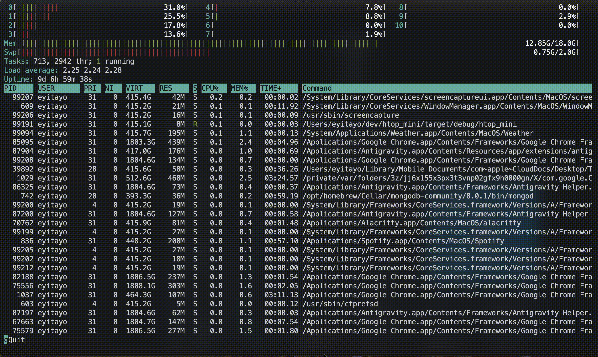

# htop_mini

A lightweight, terminal-based system monitoring tool written in Rust, inspired by [htop](https://htop.dev/).




## Overview

htop_mini is a minimal yet functional system resource monitor that provides real-time insights into your system's performance. Built with Rust for speed and reliability, it offers a clean terminal interface powered by [ratatui](https://ratatui.rs/) and [crossterm](https://github.com/crossterm-rs/crossterm).

## Features

- **Per-Core CPU Monitoring**: Visual bars showing user/system CPU usage for each core with color-coded display (green for user, red for system)
- **Memory Statistics**: Real-time tracking of active, wired, and compressed memory with visual usage bars
- **Swap Usage**: Monitor swap memory utilization
- **Process List**: View all running processes with:
  - PID, user, priority, nice value
  - Virtual and resident memory sizes
  - Process state (Running, Sleeping, Stopped, Zombie)
  - CPU and memory percentage
  - Cumulative CPU time
  - Command path
  - Sorted by CPU usage
- **Task & Thread Statistics**: Total tasks, threads, and running threads count
- **System Load Average**: 1, 5, and 15-minute load averages
- **System Uptime**: Formatted uptime display (days, hours, minutes, seconds)
- **Interactive TUI**: Clean, responsive terminal interface with 1-second refresh rate

### Platform Support

| Platform | Status |
|----------|--------|
| macOS    | Fully supported |
| Linux    | Fully supported |

## Installation

### Prerequisites

- Rust toolchain
- Cargo

### Build from Source

```bash
git clone <repository-url>
cd htop_mini

cargo build --release
```

## Usage

```bash
./target/release/htop_mini
```

Or run directly with cargo:

```bash
cargo run --release
```

## Architecture

htop_mini follows a layered architecture with clear separation between data collection, computation, and presentation:

```
┌─────────────────┐     ┌─────────────────┐     ┌─────────────────┐
│     Sampler     │────▶│      Model      │────▶│       UI        │
│ (macOS / Linux) │     │   (Snapshot)    │     │    (ratatui)    │
└─────────────────┘     └─────────────────┘     └─────────────────┘
```

## Development

### Running Tests

```bash
cargo test                    # Run all tests
```

## Roadmap
- [x] Linux support via /proc filesystem
